# MVP de Engenharia de Dados — Fundos de Crédito Privado (CVM)

**Pós-graduação em Ciência de Dados e Analytics — PUC-Rio**
**Aluno:** Richard Bryan Eulalio
**Plataforma:** Databricks Free Edition (serverless, Unity Catalog, Delta Lake)
**Fonte:** Portal de Dados Abertos da CVM — https://dados.cvm.gov.br (licença ODbL)

Pipeline em arquitetura medalhão (bronze → silver → gold) sobre os informes diários de fundos
de investimento da CVM, com recorte na indústria de fundos de crédito privado, de setembro de
2025 a julho de 2026.

| Notebook | Função |
|---|---|
| [`00_setup.ipynb`](00_setup.ipynb) | Schemas das três camadas e Volume para os arquivos brutos |
| [`01_bronze_ingestao.ipynb`](01_bronze_ingestao.ipynb) | Descompactação e ingestão dos CSVs como tabelas Delta, sem transformação |
| [`02_silver_transformacao.ipynb`](02_silver_transformacao.ipynb) | Tipagem, limpeza, deduplicação, fato e dimensões |
| [`03_gold_modelagem.ipynb`](03_gold_modelagem.ipynb) | Tabelas analíticas, indicador de reporte incompleto e catálogo de dados |
| [`04_analise.ipynb`](04_analise.ipynb) | Qualidade de dados e respostas às cinco perguntas |

---

## Contexto de Negócios e Perguntas (Etapa 2 e 4.1)

### Problema

Fundos de crédito privado carregam ativos de baixa liquidez — debêntures, CRIs, CRAs, cotas de
FIDC — e oferecem ao cotista prazos de resgate curtos. Esse descasamento entre ativo e passivo
é estrutural na indústria brasileira, e entender como o passivo se comporta (quem entra, quem
sai, quando e em que volume) é central para gestores, distribuidores e para o regulador.

A CVM publica diariamente o patrimônio, a cota, a captação, o resgate e o número de cotistas
de todas as classes de fundos. Os dados, porém, chegam brutos: arquivos mensais compactados,
todos os campos como texto, sem ligação pronta com o cadastro e, desde a Resolução CVM 175,
num grão (classe/subclasse) diferente do histórico (fundo). O objetivo deste MVP é transformar
essa base num modelo analítico confiável e usá-lo para responder a perguntas sobre o
comportamento do passivo desses fundos.

### Recorte

O recorte de crédito privado usa a `Classificacao_Anbima` do cadastro de classes — critério
oficial e auditável — e não padrões no nome do fundo:

- Renda Fixa Duração Livre Crédito Livre
- Renda Fixa Duração Livre Grau de Investimento
- Renda Fixa Duração Baixa Grau de Investimento

### Perguntas de negócio

1. Como evoluiu o PL agregado dos fundos de crédito privado no período, e quanto dessa variação
   veio de captação líquida em vez de valorização de cota?
2. Existe relação entre o porte do fundo e a estabilidade da sua base de cotistas?
3. Classes com base pulverizada apresentam padrão de captação líquida diferente de classes com
   poucos cotistas?
4. Qual é a dispersão de retorno entre classes de uma mesma classificação ANBIMA, e ela é maior
   em crédito livre do que nas categorias de grau de investimento?
5. Nos dias de resgate atípico, o movimento se concentrou em poucas datas ou se espalhou pelo
   calendário?

---

## Carga dos Dados (Etapa 4.2)

### Fonte e arquivos

| Conjunto | Arquivo | Conteúdo |
|---|---|---|
| Informe Diário de FI | `inf_diario_fi_AAAAMM.zip` × 11 (09/2025 a 07/2026) | PL, cota, captação, resgate e cotistas por classe/subclasse e dia |
| Registro de Fundos | `registro_fundo_classe.zip` | `registro_fundo.csv`, `registro_classe.csv`, `registro_subclasse.csv` |

Formato: CSV com separador `;`, encoding latin-1 (ISO-8859-1), datas em ISO e decimais com ponto.
Os dados não estão no repositório, conforme permitido pelo enunciado; os arquivos podem ser
baixados diretamente do portal da CVM.

### Processo

Os arquivos foram carregados manualmente, pelo Catalog Explorer, no Volume
`workspace.bronze.raw_cvm` do Unity Catalog. O notebook `01_bronze_ingestao` descompacta os
ZIPs dentro do próprio Volume, preservando os originais, e persiste cada conjunto como tabela
Delta.

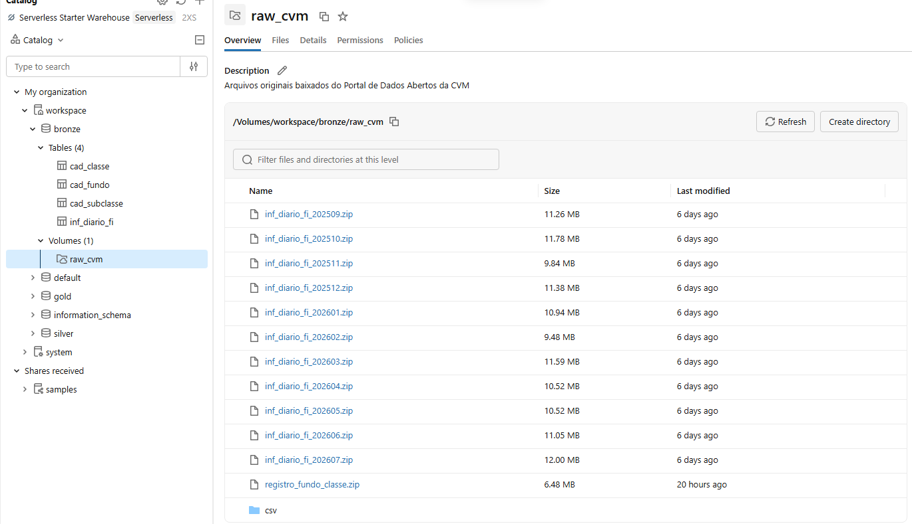

Três decisões orientam a camada bronze:

- **Todos os campos lidos como texto** (`inferSchema=False`). Tipagem é uma transformação
  explícita e pertence à silver; inferir tipos na ingestão apagaria a evidência do que
  efetivamente chegou.
- **Leitura arquivo a arquivo, unida por nome de coluna** (`unionByName(allowMissingColumns=True)`).
  Ler a pasta inteira seria mais curto, mas desalinharia os dados se o layout mudasse entre
  meses — um risco real com a migração para a RCVM 175.
- **Metadados de controle em cada linha** (`_arquivo_origem`, `_data_ingestao`), para rastrear
  de qual arquivo veio cada registro. Nada é filtrado nem deduplicado: a bronze funciona como
  cofre de evidências.

| Tabela bronze | Linhas |
|---|---|
| `inf_diario_fi` | 5.856.926 |
| `cad_fundo` | 90.384 |
| `cad_classe` | 36.782 |
| `cad_subclasse` | 10.121 |

---

## Modelagem e Catálogo de Dados (Etapa 4.3)

### Estrutura no Unity Catalog

As camadas foram implementadas como **schemas** dentro do catálogo `workspace`, e não como
catálogos separados, por limitação da Databricks Free Edition. A progressão lógica
bruto → limpo → pronto para consumo é preservada.

```
workspace (catálogo)
├── bronze
│   ├── raw_cvm (Volume)   arquivos ZIP e CSV originais
│   ├── inf_diario_fi      5.856.926 linhas
│   ├── cad_fundo             90.384 linhas
│   ├── cad_classe            36.782 linhas
│   └── cad_subclasse         10.121 linhas
├── silver
│   ├── fato_informe       5.831.186 linhas   grão: classe/subclasse × dia útil
│   ├── dim_classe            36.769 classes  (4.847 de crédito privado)
│   ├── dim_gestor             1.340 gestores
│   └── dim_tempo                231 dias úteis
└── gold
    ├── fluxo_diario_credito_privado      231 linhas  grão: dia
    └── resumo_classe_credito_privado   4.473 linhas  grão: classe
```

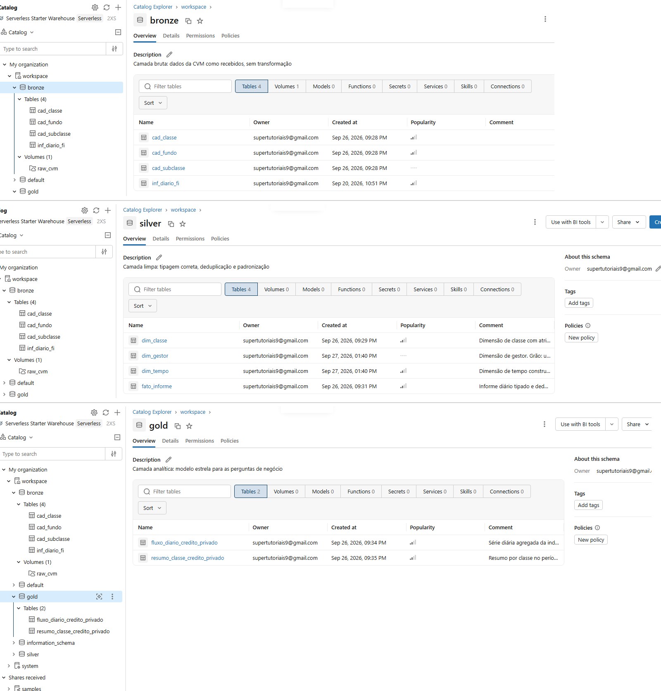

### Modelo

Modelo estrela com uma fato e três dimensões na silver, e duas tabelas agregadas na gold,
orientadas às perguntas.

```
                     dim_tempo
                         |
   dim_gestor —— dim_classe —— fato_informe
```

A `dim_gestor` se liga à fato através da `dim_classe` (snowflake de um nível), porque o gestor
é atributo da classe no cadastro, não do informe diário.

**Grão da fato.** Com a RCVM 175, o informe deixou de ser por fundo e passou a ser por classe e
subclasse. Foi testado empiricamente que, quando uma classe tem subclasses, apenas as linhas de
subclasse são publicadas: não há linha consolidada da classe na mesma data (o teste no `02`
retorna zero sobreposições). Isso garante que somar o PL não gera dupla contagem dentro do
arquivo. A chave natural da fato é `cnpj_classe` + `id_subclasse` + `data`.

**Decisões de modelagem**

- **Crédito privado pela classificação ANBIMA**, como coluna booleana `credito_privado` na
  `dim_classe`.
- **Classes feeder marcadas por padrão na denominação** ("EM COTAS", "FIC"). É uma aproximação
  explícita, usada para calcular `pl_total_ex_feeder` e mitigar a dupla contagem de estruturas
  master-feeder. Não substitui a hierarquia real de investimento, que a base não fornece.
- **Chave substituta de gestor** por MD5 do nome normalizado, porque a CVM não publica
  identificador de gestor.
- **`dim_tempo` derivada das datas presentes na fato**, e não de um calendário sintético — cada
  linha é um dia com informe publicado. Os atributos de fim de mês, fim de trimestre e dezembro
  existem para testar objetivamente o efeito de calendário da Pergunta 5.
- **Cadastro como fotografia**: o registro de classes reflete a situação no último dia útil,
  não uma série histórica. A classificação usada é a atual, não a vigente em cada data.

### Catálogo de dados

O catálogo está registrado no próprio Unity Catalog, com `COMMENT ON TABLE` e
`ALTER TABLE ... ALTER COLUMN ... COMMENT` em todas as tabelas silver e gold (notebook `03`,
seção 3.4). Os comentários carregam também as ressalvas metodológicas, para que quem consultar
a tabela encontre a limitação junto com o dado. A transcrição segue abaixo.

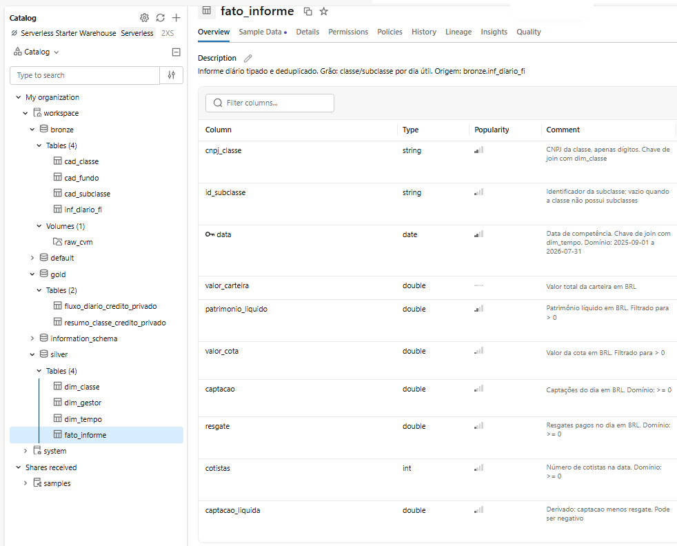

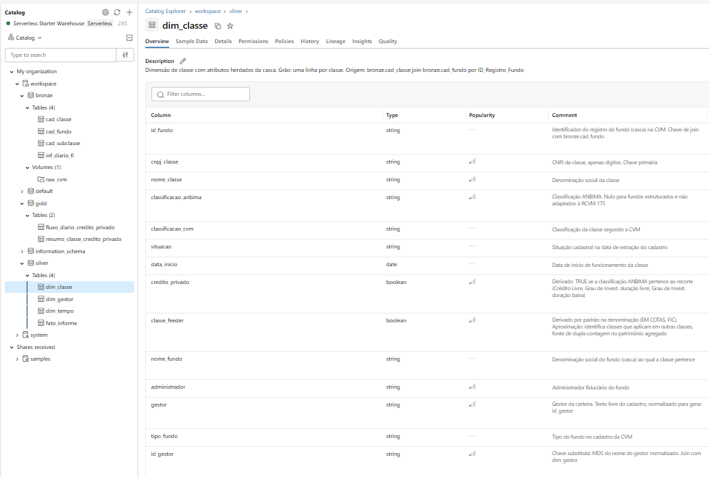

**Camada bronze.** As quatro tabelas reproduzem as colunas dos CSVs da CVM, todas do tipo
`string`, acrescidas de `_arquivo_origem` (string, caminho do arquivo de origem) e
`_data_ingestao` (timestamp da carga). Colunas do informe: `TP_FUNDO_CLASSE`,
`CNPJ_FUNDO_CLASSE`, `ID_SUBCLASSE`, `DT_COMPTC`, `VL_TOTAL`, `VL_QUOTA`, `VL_PATRIM_LIQ`,
`CAPTC_DIA`, `RESG_DIA`, `NR_COTST`.

#### `silver.fato_informe`
Informe diário tipado e deduplicado. Grão: classe/subclasse por dia útil. Origem: `bronze.inf_diario_fi`.

| Coluna | Tipo | Descrição | Domínio |
|---|---|---|---|
| `cnpj_classe` | string | CNPJ da classe, apenas dígitos. Chave de join com `dim_classe` | 14 dígitos |
| `id_subclasse` | string | Identificador da subclasse | Vazio quando a classe não tem subclasses |
| `data` | date | Data de competência. Chave de join com `dim_tempo` | 2025-09-01 a 2026-07-31, dias úteis |
| `valor_carteira` | double | Valor total da carteira | BRL |
| `patrimonio_liquido` | double | Patrimônio líquido | BRL, > 0 |
| `valor_cota` | double | Valor da cota | BRL, > 0 |
| `captacao` | double | Captações do dia | BRL, ≥ 0 |
| `resgate` | double | Resgates pagos no dia | BRL, ≥ 0 |
| `cotistas` | int | Número de cotistas na data | ≥ 0 |
| `captacao_liquida` | double | Derivado: `captacao − resgate` | BRL, pode ser negativo |

#### `silver.dim_classe`
Uma linha por classe, com atributos herdados do fundo (casca). Origem: `bronze.cad_classe` join `bronze.cad_fundo` por `ID_Registro_Fundo`.

| Coluna | Tipo | Descrição | Domínio |
|---|---|---|---|
| `cnpj_classe` | string | CNPJ da classe, apenas dígitos. Chave primária | 14 dígitos |
| `id_fundo` | string | Identificador do registro do fundo na CVM | — |
| `nome_classe` | string | Denominação social da classe | — |
| `classificacao_anbima` | string | Classificação ANBIMA | Nulo para fundos estruturados e não adaptados à RCVM 175 |
| `classificacao_cvm` | string | Classificação CVM | — |
| `situacao` | string | Situação cadastral na data de extração | — |
| `data_inicio` | date | Data de início da classe | — |
| `credito_privado` | boolean | Derivado: classificação ANBIMA pertence ao recorte | TRUE / FALSE |
| `classe_feeder` | boolean | Derivado: denominação contém "EM COTAS" ou "FIC". Aproximação | TRUE / FALSE |
| `nome_fundo` | string | Denominação do fundo (casca) | — |
| `administrador` | string | Administrador fiduciário | — |
| `gestor` | string | Gestor da carteira | — |
| `tipo_fundo` | string | Tipo do fundo no cadastro | — |
| `id_gestor` | string | Chave substituta: MD5 do nome do gestor normalizado. Join com `dim_gestor` | Hash de 32 caracteres |

#### `silver.dim_gestor`
Um gestor por linha. Origem: agregação de `silver.dim_classe`.

| Coluna | Tipo | Descrição |
|---|---|---|
| `id_gestor` | string | Chave substituta (MD5 do nome normalizado) |
| `nome_gestor` | string | Nome do gestor |
| `n_classes` | long | Classes sob gestão |
| `n_classes_cp` | long | Classes de crédito privado sob gestão |
| `n_administradores` | long | Administradores distintos com que o gestor opera |

#### `silver.dim_tempo`
Um dia útil com informe publicado por linha. Origem: datas distintas de `silver.fato_informe`, após remoção dos feriados ANBIMA.

| Coluna | Tipo | Descrição |
|---|---|---|
| `data` | date | Chave primária |
| `ano`, `mes`, `trimestre` | int | Componentes da data |
| `ano_mes` | string | Formato `yyyy-MM` |
| `dia_semana` | string | Nome do dia da semana |
| `ultimo_dia_util_mes` | boolean | Última data com informe no mês |
| `primeiro_dia_util_mes` | boolean | Primeira data com informe no mês |
| `ultimo_dia_util_trimestre` | boolean | Último dia útil de março, junho, setembro ou dezembro |
| `dezembro` | boolean | Data em dezembro |

#### `gold.fluxo_diario_credito_privado`
Série diária agregada da indústria de crédito privado. Grão: um dia. Origem: `silver.fato_informe` join `dim_classe` e `dim_tempo`, filtrado por `credito_privado`.

| Coluna | Tipo | Descrição |
|---|---|---|
| `data` | date | Chave primária |
| `pl_total` | double | Soma bruta do PL. Contém dupla contagem por estruturas feeder |
| `pl_total_ex_feeder` | double | PL excluindo classes de investimento em cotas. Aproximação do valor alocado em ativos |
| `captacao_total`, `resgate_total` | double | Somas do dia, BRL |
| `captacao_liquida_total` | double | Captação menos resgate. Pode ser negativo |
| `cotistas_total` | long | Soma de cotistas |
| `n_classes` | long | Classes distintas com informe no dia |
| `grandes_ausentes` | long | Quantas das 100 maiores classes não reportaram no dia, considerando só datas entre o primeiro e o último informe de cada classe |
| `reporte_completo` | boolean | FALSE quando alguma das 100 maiores está ausente. Dias FALSE devem ser excluídos de análises de série temporal |
| `ano_mes`, `ultimo_dia_util_mes`, `ultimo_dia_util_trimestre`, `dezembro` | — | Herdados da `dim_tempo` |

#### `gold.resumo_classe_credito_privado`
Resumo por classe no período. Grão: uma classe. Origem: `silver.fato_informe` join `dim_classe`.

| Coluna | Tipo | Descrição |
|---|---|---|
| `cnpj_classe` | string | Chave primária |
| `nome_classe`, `classificacao_anbima`, `id_gestor`, `gestor`, `classe_feeder` | — | Herdados da `dim_classe` |
| `pl_medio`, `pl_maximo` | double | PL da classe (somadas as subclasses) no período |
| `captacao_periodo`, `resgate_periodo`, `captacao_liquida_periodo` | double | Fluxos acumulados no período |
| `cotistas_medio`, `cotistas_desvio` | double | Média e desvio padrão do número de cotistas da classe por dia |
| `cv_cotistas` | double | Derivado: desvio sobre média. Proxy de estabilidade da base |
| `dias` | long | Dias com informe, no grão classe × dia |
| `primeira_data`, `ultima_data` | date | Primeiro e último informe na janela |
| `dias_corridos` | int | Dias corridos entre o primeiro e o último informe |
| `retorno_periodo` | double | Retorno de cota por subclasse (janela ordenada por data), agregado pela média ponderada pelo PL médio das subclasses. Subestima classes que amortizam ou distribuem rendimento |
| `n_subclasses` | long | Subclasses com informe no período (classe sem subclasse conta como 1) |

---

## Pipeline de Dados (Etapa 4.4)

### Ramificação em notebooks

O pipeline foi dividido em cinco notebooks, um por etapa, executados em sequência sobre
computação serverless. Cada notebook lê apenas tabelas persistidas pela etapa anterior e grava
com `mode("overwrite")`, o que o torna idempotente: pode ser reexecutado sem duplicar dados.

```
00_setup  →  01_bronze_ingestao  →  02_silver_transformacao  →  03_gold_modelagem  →  04_analise
 schemas       ZIP/CSV → Delta         tipagem, limpeza,          agregações,           qualidade e
 e Volume      (tudo texto)            fato e dimensões           indicador e catálogo  perguntas
```

A divisão por camada tem um motivo prático: quando uma regra muda na silver, basta reexecutar
do `02` em diante, sem recarregar os arquivos. Isso foi usado na prática durante o projeto,
quando o filtro de feriados e a correção de grão exigiram reprocessar silver e gold.

### Transformações da silver

| Transformação | Por quê |
|---|---|
| Normalização do CNPJ (apenas dígitos) | Cadastro e informe usam formatos diferentes; sem isso o join falharia silenciosamente |
| Tipagem explícita | Valores para double, competência para date, cotistas para int |
| Deduplicação pela chave natural | A bronze traz chaves repetidas |
| Filtro de validade (PL > 0 e cota > 0) | Remove classes em encerramento, que distorceriam médias e retornos |
| Filtro de calendário (feriados ANBIMA) | Envios isolados em feriados criavam dias úteis falsos na `dim_tempo` |
| Coluna derivada `captacao_liquida` | Padroniza o sinal e evita recálculo |
| Particionamento por `data` | Todas as consultas filtram ou agrupam por período |

### Agregações da gold

As duas tabelas gold agregam primeiro no **grão classe × dia** e só depois no período ou no dia.
Esse cuidado é necessário porque a fato está no grão de subclasse: agregar direto sobre as linhas
faria `pl_medio` virar média por subclasse, misturaria subclasses no desvio de cotistas e
calcularia retornos com a cota inicial de uma subclasse e a final de outra. O retorno é
calculado por subclasse, com janela ordenada por data, e ponderado pelo PL.

### Linhagem

A aba **Lineage** do Unity Catalog desenha automaticamente o grafo bronze → silver → gold:

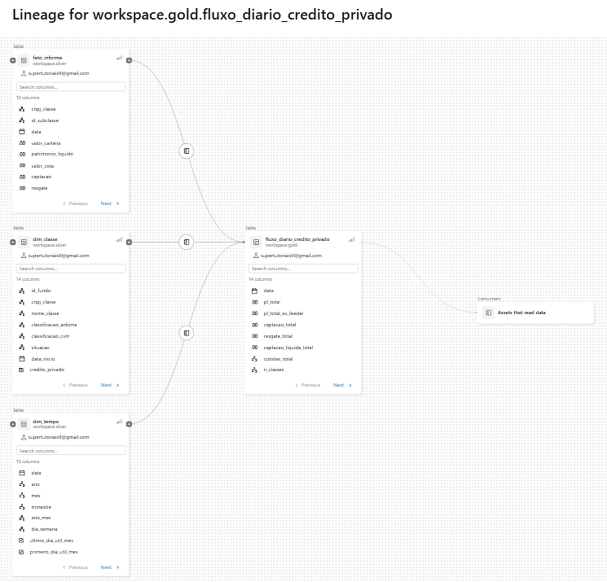

### Tabelas persistidas

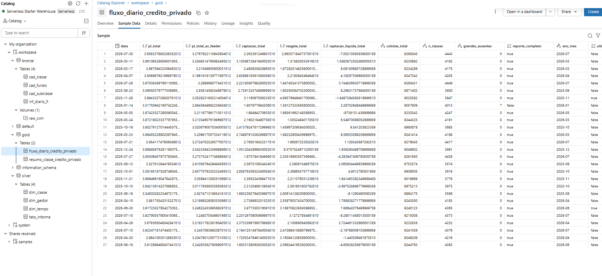

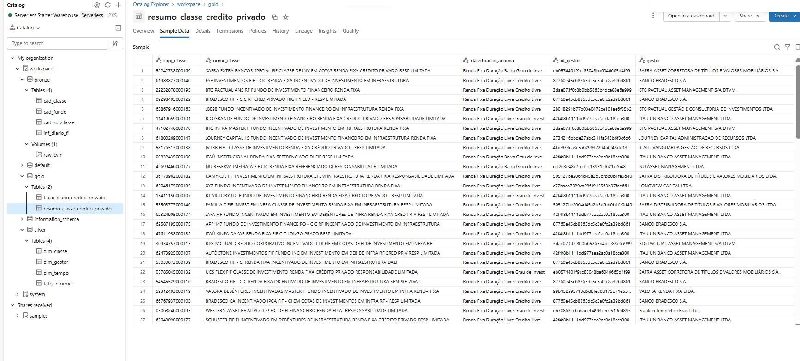

---

## Qualidade de Dados (Etapa 4.5)

### Verificação por dimensão (sobre a bronze)

| Dimensão | Verificação | Resultado | Tratamento |
|---|---|---|---|
| Unicidade | Chaves `CNPJ + subclasse + data` repetidas | 88 chaves | Deduplicadas na silver |
| Acurácia | PL ≤ 0 | 25.642 registros (0,44%) | Removidos: classes em encerramento |
| Completude | Cota nula ou ≤ 0 | 22.621 registros (0,39%) | Removidos |
| Consistência | Zero cotistas | 20.334 registros (0,35%) | Mantidos: classe ativa sem cotista no dia não é erro |
| Consistência | Data de competência inválida | 0 | — |
| Consistência | Registros em feriados ANBIMA | 6 registros de 6 classes | Removidos (ver abaixo) |
| Completude | Classes sem classificação ANBIMA | 10.174 classes | Causa conhecida: fundos estruturados e não adaptados à RCVM 175 |
| Integridade referencial | Classes de crédito privado no cadastro × com informe | 4.847 × 4.473 | Diferença de 374: registradas sem operação na janela ou encerradas antes de 09/2025 |

**Balanço bronze → silver:** 5.856.926 → 5.831.186 linhas, perda de 25.740 (0,44%). As
categorias acima se sobrepõem (um mesmo registro pode ter PL e cota inválidos), por isso a
perda total é menor que a soma.

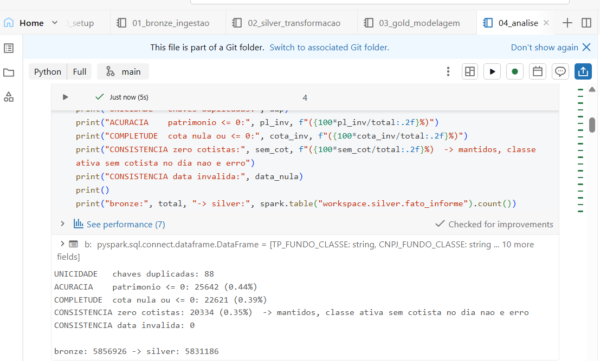

### Achado principal: descontinuidade de 13/01/2026

O PL agregado de crédito privado cai de R$ 3,70 tri para R$ 3,53 tri em um dia e se recupera na
semana seguinte. A investigação descartou as duas explicações óbvias:

- **Não foi resgate:** a captação líquida do dia foi **positiva**, de R$ 17,7 bi.
- **Não foi queda geral de reporte:** o número de classes variou só de 4.011 para 4.007.

A comparação classe a classe entre 12/01 e 13/01 identificou **sete classes de crédito privado
sem informe no dia**, somando R$ 189,7 bi de PL na véspera — seis delas administradas pelo Banco
do Brasil (BB Top DI, BB Top DI Longo Prazo, BB Top Renda Fixa Instituições Financeiras Crédito
Privado, BB RF Liquidez, BB Renda Fixa Referenciado DI Longo Prazo Private e um FIF Tesouro Renda
Fixa). Conclusão: **ausência pontual de reporte, não movimento patrimonial.**

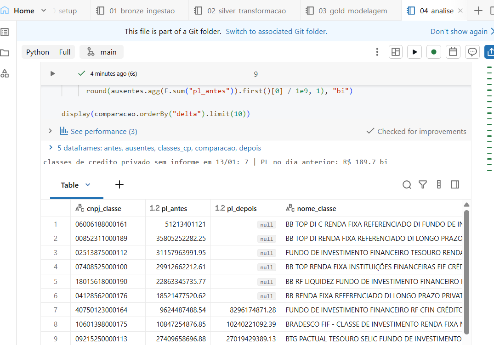

**Decisão: não aplicar forward fill.** (a) Preencher assumiria patrimônio constante, o que é
suposição e não dado; (b) criaria inconsistência entre a série de PL e a de captação líquida,
apresentadas lado a lado; (c) apagaria uma característica real da base — a dependência da série
agregada em poucos reportantes de grande porte. Em vez disso, os dias afetados são **marcados**.

### Detecção sistemática de reporte incompleto

Como o número total de classes não detecta o caso, a gold ganhou um indicador próprio: quantas
das **100 maiores classes** estão ausentes em cada dia (`grandes_ausentes`, `reporte_completo`).

O indicador passou por duas correções, e a sequência mostra por que validar um indicador de
qualidade é tão importante quanto construí-lo:

1. **Primeira versão: 71 de 234 dias incompletos.** O número parecia alto demais. A verificação
   mostrou um viés: classes que começaram a reportar no meio do período contavam como ausentes
   em todos os dias anteriores. A correção passou a considerar ausente só quem já existia e
   ainda não tinha saído da janela. A mesma revisão corrigiu o grão: o PL passou a ser somado por
   classe e dia antes do ranking, porque a média direta sobre as linhas de subclasse subestimava
   classes com várias subclasses.
2. **Segunda versão: a correção expôs outro problema.** Três datas apareceram com 99 ou 100 das
   100 maiores ausentes: 20/11/2025 (Consciência Negra), 25/12/2025 (Natal) e 04/06/2026
   (Corpus Christi, feriado no calendário ANBIMA). Havia seis envios isolados nessas datas, todos
   de classes fora do recorte. Como a `dim_tempo` é derivada das datas da fato, eles criavam três
   dias úteis inexistentes. Os feriados passaram a ser removidos na silver.

**Resultado final: 6 dias de 231 com reporte incompleto** — 26/11/2025 (1 ausente), 13 a
16/01/2026 (6 a 7 ausentes, o episódio do BB) e 02/03/2026 (2). Em 13/01 o indicador marca 6,
e não 7, porque uma das sete classes ausentes não está entre as 100 maiores.

Limitação conhecida: uma classe que para de reportar no fim da janela não é detectada, porque seu
último informe passa a ser a última data.

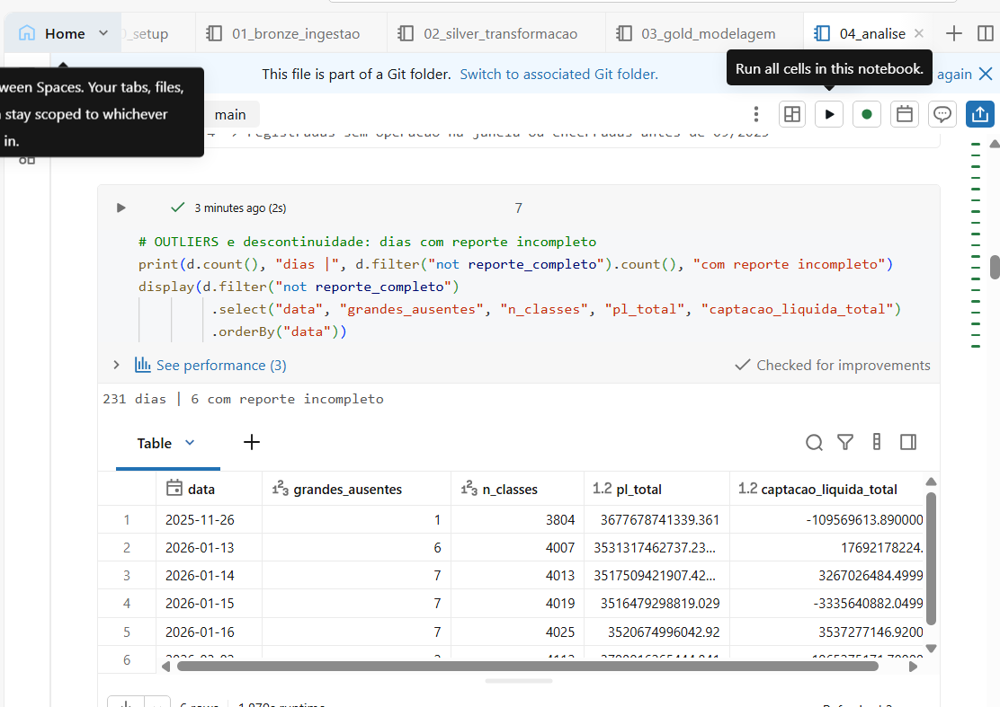

---

## Análise de Dados (Etapa 4.5)

Salvo indicação, as análises de série temporal usam apenas os 225 dias com reporte completo,
e as comparações entre classes usam só classes com histórico suficiente (mais de 100 dias de
informe nas Perguntas 2 e 3; mais de 250 dias corridos na Pergunta 4, para que o retorno
acumulado seja comparável). Por isso os `n` variam entre perguntas: 4.154 classes nas Perguntas 2
e 3, e 3.812 na Pergunta 4, de um total de 4.473.

### Pergunta 1 — Evolução do PL e papel da captação líquida

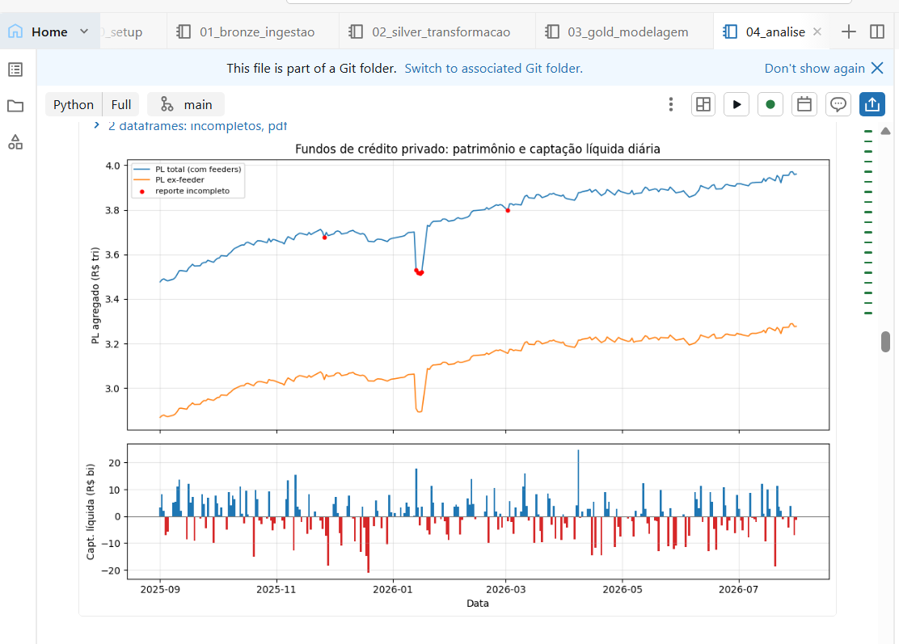

| Métrica | Valor |
|---|---|
| PL inicial | R$ 3,477 tri |
| PL final | R$ 3,960 tri |
| Variação | + R$ 483,5 bi (+13,9%) |
| Captação líquida acumulada | + R$ 28,3 bi |
| Parcela explicada por captação | 5,9% |
| Parcela explicada por valorização de cota (resíduo) | 94,1% |

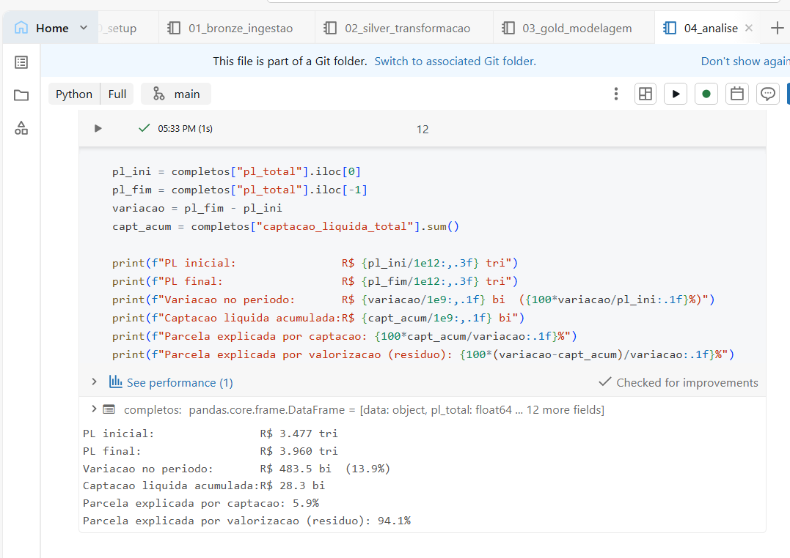

**Discussão.** O PL cresceu quase 14% no período, mas praticamente todo o crescimento veio da
valorização das cotas, e não de dinheiro novo. A captação líquida diária oscila em torno de zero
sem viés claro. O resultado é coerente com o domínio: uma alta patrimonial de 13,9% em onze
meses é da ordem do carrego de renda fixa com juros elevados, e a Pergunta 4 mostra retornos
medianos entre 9% e 13% no mesmo período.

Os pontos vermelhos no gráfico marcam os dias com reporte incompleto; o vale de 13/01 é o
episódio descrito na seção de qualidade, e não um movimento de mercado.

Ressalva: o nível absoluto do `pl_total` contém dupla contagem por estruturas master-feeder. A
série `pl_total_ex_feeder` mitiga, mas não elimina, porque a marcação de feeder é aproximada.
Como a captação também é duplicada nas mesmas estruturas, a **proporção** entre captação e
valorização é menos afetada do que o nível.

### Pergunta 2 — Porte e estabilidade da base de cotistas

Medida: coeficiente de variação (CV) do número de cotistas de cada classe ao longo do período.

| Faixa de PL médio | CV médio | CV mediano | n |
|---|---|---|---|
| até R$ 10 mi | 0,084 | 0,020 | 222 |
| R$ 10–100 mi | 0,060 | 0,000 | 1.947 |
| R$ 100 mi–1 bi | 0,089 | 0,021 | 1.400 |
| acima de R$ 1 bi | 0,069 | 0,034 | 585 |

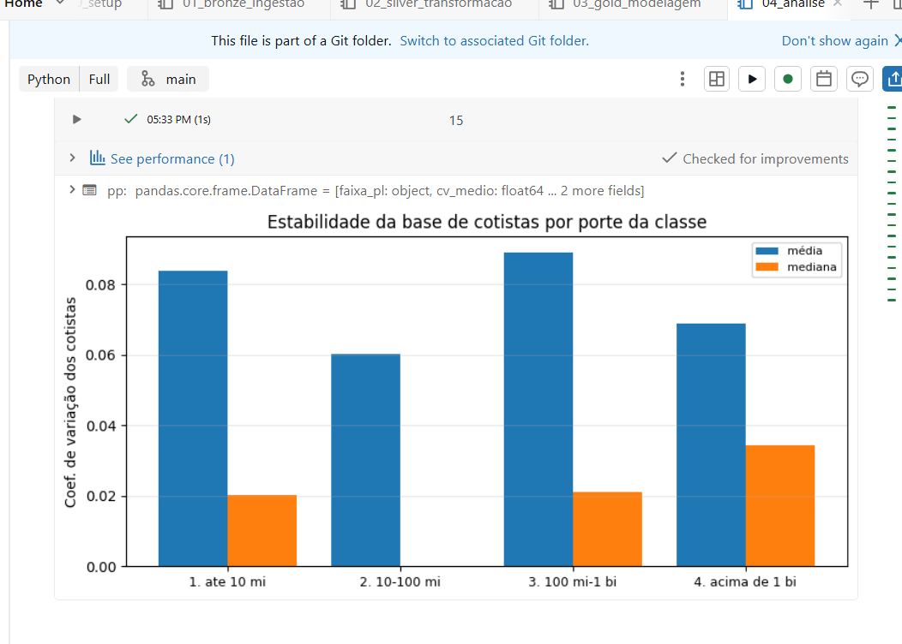

**Discussão.** Pela média, **não há relação monotônica** entre porte e estabilidade: a faixa de
R$ 10 a 100 mi é a mais estável e a de R$ 100 mi a 1 bi a mais volátil. Pela mediana, a leitura
muda: a partir da segunda faixa, a variação da base **cresce** com o porte (0 → 0,021 → 0,034).
A distância entre média e mediana mostra que as médias são puxadas por poucas classes com
variação extrema.

A mediana zero na faixa de R$ 10 a 100 mi indica que a maioria dessas classes tem número de
cotistas constante, perfil típico de fundos exclusivos ou restritos. Nas faixas maiores, bases
pulverizadas têm entrada e saída contínua de cotistas, o que eleva o CV mesmo sem instabilidade
no sentido de risco.

Ressalva: o CV mede **qualquer** variação da base, inclusive crescimento. Uma classe que ganha
cotistas de forma constante tem CV alto. A pergunta, portanto, tem resposta negativa para a
hipótese intuitiva ("fundos maiores têm base mais estável"), mas a métrica não separa
crescimento de rotatividade.

### Pergunta 3 — Pulverização da base e captação líquida

| Perfil (cotistas médios) | Captação líquida média | Mediana | Total | n |
|---|---|---|---|---|
| Concentrado (< 10) | + R$ 11,1 mi | R$ 0,0 mi | + R$ 30,0 bi | 2.706 |
| Intermediário (10–1.000) | + R$ 4,3 mi | − R$ 0,8 mi | + R$ 4,0 bi | 924 |
| Pulverizado (> 1.000) | − R$ 48,1 mi | − R$ 18,7 mi | − R$ 25,2 bi | 524 |

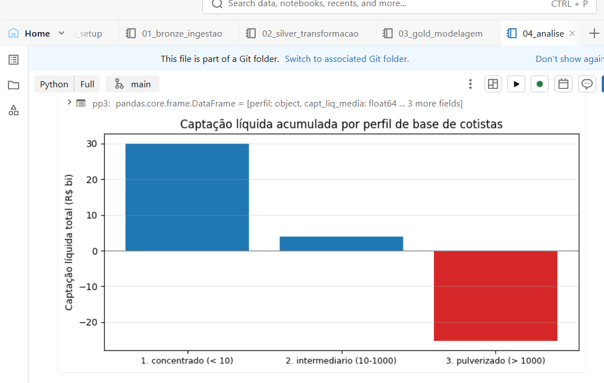

**Discussão.** É o resultado mais nítido do trabalho. Classes com base pulverizada tiveram saída
líquida de R$ 25,2 bi no período, enquanto classes com menos de dez cotistas captaram R$ 30,0 bi.
O resultado é robusto a valores extremos: a mediana das pulverizadas também é negativa
(− R$ 18,7 mi), então a saída não é efeito de poucas classes grandes.

O padrão é consistente com saída de recursos do varejo e entrada de recursos institucionais e de
investidores qualificados. Essa é, porém, uma **interpretação de mercado**, não uma conclusão
direta dos dados. O grupo "concentrado" mistura fundos exclusivos e restritos com fundos master,
cujos cotistas são outros fundos. A base da CVM não identifica o tipo de cotista, e separar essas
duas origens exigiria a composição de carteira dos feeders.

### Pergunta 4 — Dispersão de retorno por classificação ANBIMA

| Classificação | Retorno médio | Mediano | Desvio padrão | p25 | p75 | Intervalo interquartil | n |
|---|---|---|---|---|---|---|---|
| RF Duração Livre Crédito Livre | 8,9% | 9,4% | 5,6% | 6,6% | 12,0% | 5,4 p.p. | 2.480 |
| RF Duração Livre Grau de Invest. | 11,6% | 12,8% | 5,6% | 10,9% | 13,4% | 2,4 p.p. | 850 |
| RF Duração Baixa Grau de Invest. | 12,9% | 13,2% | 1,3% | 12,8% | 13,4% | 0,7 p.p. | 482 |

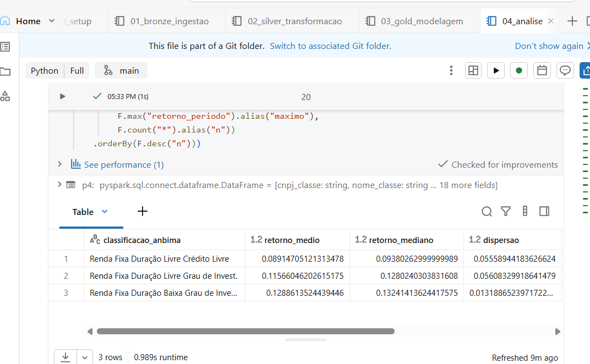

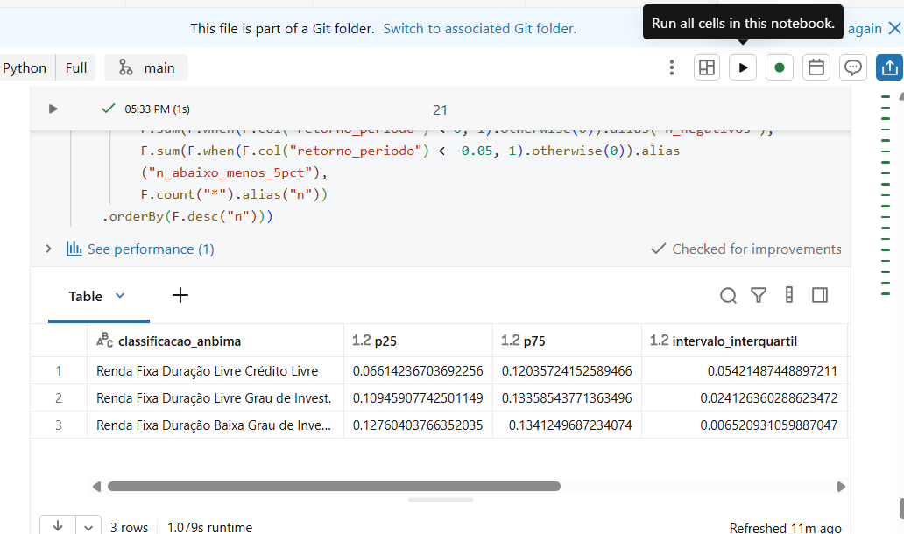

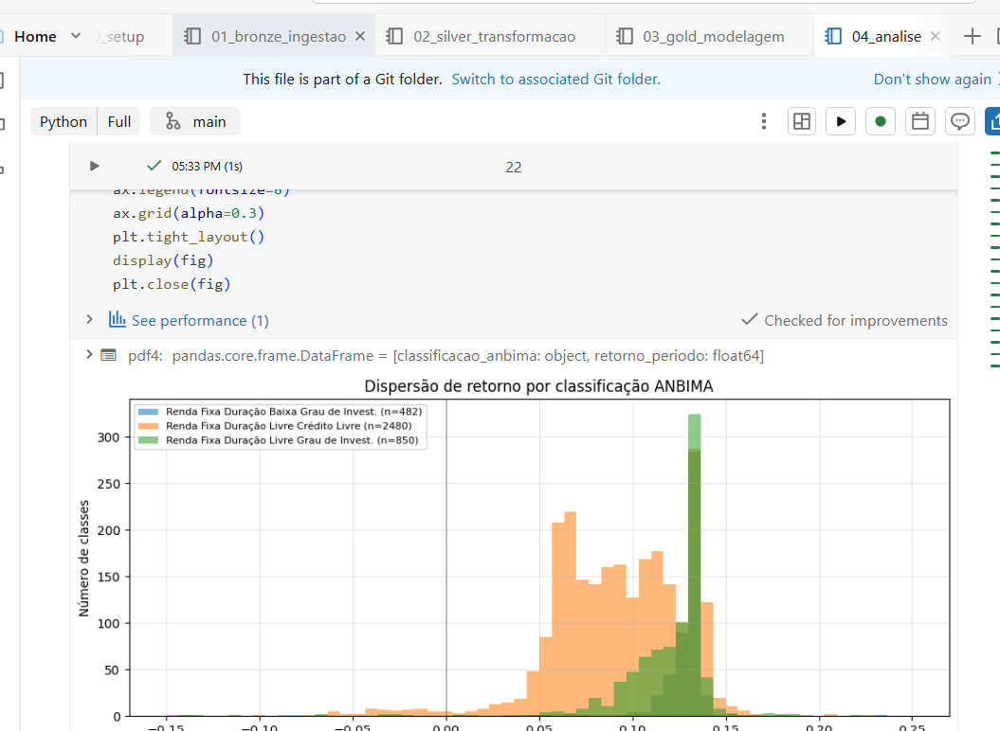

**Discussão.** A resposta depende da medida de dispersão, e essa diferença é o achado:

- **Pelo desvio padrão**, crédito livre (5,6%) e grau de investimento de duração livre (5,6%)
  têm a mesma dispersão; só a duração baixa se destaca, com 1,3%.
- **Pelo intervalo interquartil**, que ignora as caudas, o crédito livre dispersa **2,2 vezes**
  mais que o grau de investimento de duração livre (5,4 contra 2,4 p.p.) e **8 vezes** mais que o
  de duração baixa (0,7 p.p.).

O desvio padrão alto do grau de investimento de duração livre vem de poucas classes muito fora
da curva. O histograma mostra o resto: as classes de grau de investimento convergem num pico
estreito em torno de 13% — o carrego do período —, enquanto o crédito livre se espalha entre
5% e 12% e concentra a cauda negativa. A diferença entre as categorias é de **forma** da
distribuição, e não apenas de magnitude.

Resposta: sim, a dispersão típica é maior em crédito livre, desde que medida de forma robusta.
Pelo desvio padrão, a separação relevante é por duração, e não por qualidade de crédito.

Ressalvas: (a) retorno medido por variação de cota subestima classes que amortizam ou distribuem
rendimento; (b) a comparação com o CDI do período não foi incorporada ao pipeline; (c) esta
métrica exigiu duas correções. A primeira versão usava `first`/`last` sem janela ordenada e
produziu retornos médios negativos, implausíveis para renda fixa de crédito. A segunda misturava
cotas de subclasses diferentes na mesma classe. Os dois erros foram detectados por validação de
plausibilidade e revisão do grão, não por falha de execução.

### Pergunta 5 — Dias de resgate atípico

Os dez maiores dias de resgate, entre os dias com reporte completo:

| Data | Resgate | Captação líquida | Último dia útil do mês |
|---|---|---|---|
| 2025-12-19 | R$ 56,3 bi | − R$ 20,9 bi | não |
| 2025-12-29 | R$ 49,8 bi | − R$ 10,5 bi | não |
| 2025-11-28 | R$ 49,7 bi | − R$ 18,5 bi | sim |
| 2026-05-29 | R$ 43,1 bi | − R$ 10,8 bi | sim |
| 2025-12-15 | R$ 41,0 bi | − R$ 13,4 bi | não |
| 2025-12-18 | R$ 40,4 bi | − R$ 14,8 bi | não |
| 2026-04-30 | R$ 39,4 bi | − R$ 7,5 bi | sim |
| 2025-11-10 | R$ 38,4 bi | − R$ 12,7 bi | não |
| 2025-12-22 | R$ 38,3 bi | − R$ 3,7 bi | não |
| 2025-12-30 | R$ 37,9 bi | + R$ 7,9 bi | não |

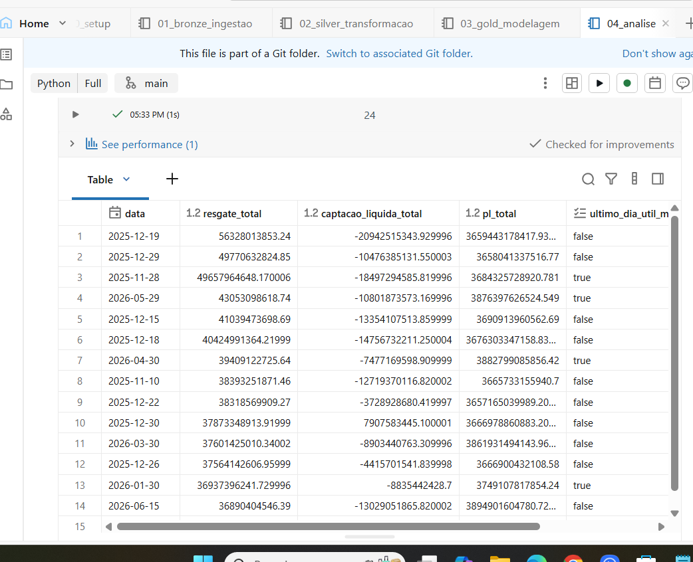

Teste do efeito de calendário, com os atributos da `dim_tempo`:

| Tipo de dia | Resgate médio | Captação líquida média | Dias |
|---|---|---|---|
| Dia comum | R$ 23,8 bi | + R$ 0,3 bi | 214 |
| Último dia útil do mês | R$ 38,6 bi | − R$ 7,7 bi | 7 |
| Último dia útil do trimestre | R$ 24,7 bi | + R$ 4,4 bi | 4 |
| Dezembro | R$ 31,7 bi | − R$ 2,5 bi | 22 |
| Demais meses | R$ 23,5 bi | + R$ 0,4 bi | 203 |

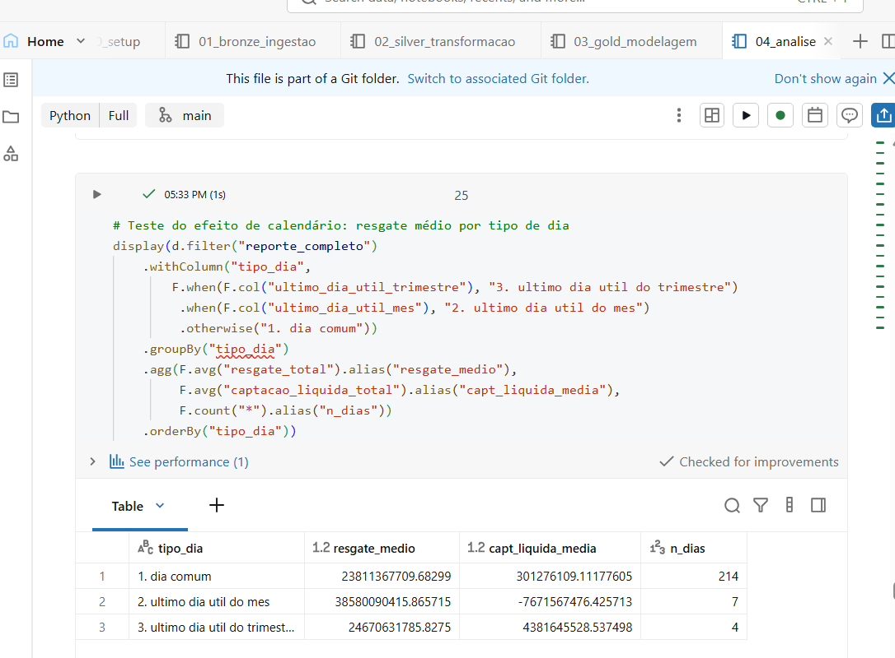

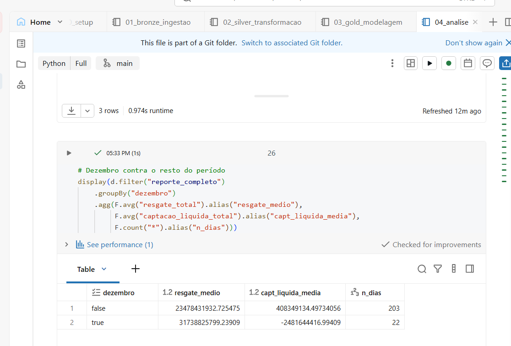

**Discussão.** Os resgates atípicos são **concentrados e sazonais**, não espalhados. Seis dos dez
maiores dias são de dezembro de 2025, e três dos quatro restantes são fins de mês. Em dezembro,
o resgate médio diário é 35% maior que no resto do período, e a captação líquida média fica
negativa. O padrão aponta para efeito de calendário — planejamento tributário e fechamento de
balanço —, e não para estresse de crédito difuso. Em 30/12, mesmo com o décimo maior resgate,
a captação líquida foi positiva, o que sugere recomposição imediata.

Um detalhe chama atenção: o último dia útil do trimestre tem resgate médio igual ao de um dia
comum, enquanto os outros fins de mês ficam bem acima. Separando os fins de mês:

| Fins de mês | Resgate médio | Captação líquida média | Dias |
|---|---|---|---|
| Maio e novembro | R$ 46,4 bi | − R$ 14,6 bi | 2 |
| Demais meses | R$ 30,7 bi | − R$ 0,8 bi | 9 |

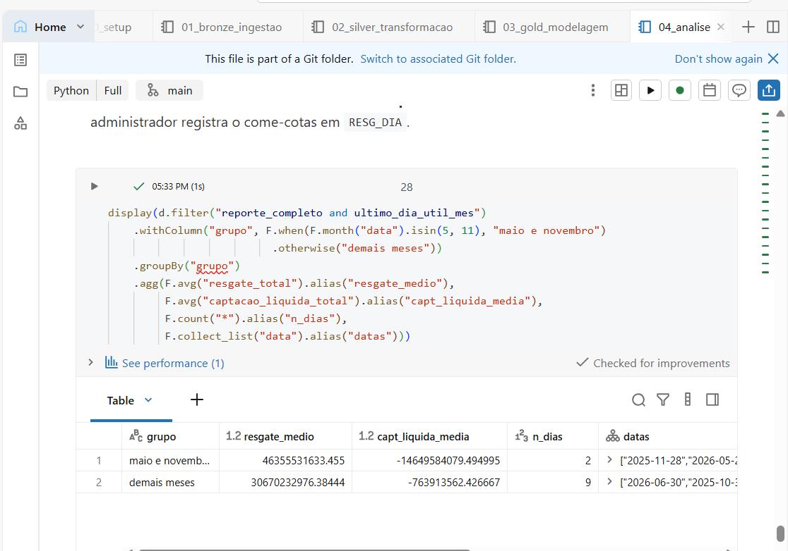

O último dia útil de maio e de novembro são as datas de **come-cotas**. A hipótese é que parte do
"resgate" desses dias seja o recolhimento semestral de imposto, lançado pelos administradores em
`RESG_DIA`. A base não permite confirmar isso, e com apenas duas observações o resultado é
indicativo. Mesmo excluindo maio e novembro, os fins de mês continuam acima do dia comum
(R$ 30,7 bi contra R$ 23,8 bi), então o efeito de fim de mês não se resume ao come-cotas.

---

## Autoavaliação

**Objetivos atingidos.** O pipeline cobre as quatro etapas técnicas do enunciado — carga,
modelagem com catálogo, pipeline em camadas e análise — e as cinco perguntas foram respondidas
com dados. Três delas têm resposta clara (P1, P3 e P5); duas (P2 e P4) têm resposta condicionada
à métrica, e o texto mostra por quê, em vez de escolher a métrica que confirma a hipótese.

**O que funcionou melhor.** A parte de qualidade de dados foi a que mais agregou ao trabalho.
A descontinuidade de 13/01 levou a um indicador de reporte incompleto, e revisá-lo revelou dois
problemas que eu não teria encontrado de outra forma: o viés de classes que entram no meio do
período e os feriados na `dim_tempo`. Também encontrei e corrigi erros de grão (subclasse ×
classe) que afetavam retorno, PL médio e CV de cotistas. Todos esses erros produziam números
plausíveis à primeira vista ou apenas levemente estranhos; nenhum gerou falha de execução.
A lição principal do projeto é que validar resultado contra conhecimento do domínio é parte do
pipeline, e não uma etapa opcional.

**Limitações.**

- A dupla contagem por estruturas master-feeder foi mitigada por aproximação na denominação, mas
  não resolvida. Isso afeta o nível absoluto do PL na Pergunta 1.
- O cadastro é uma fotografia do último dia útil. Há viés de sobrevivência, e a classificação
  ANBIMA usada é a atual, não a vigente em cada data.
- O retorno por variação de cota subestima classes que amortizam ou distribuem rendimento, e não
  foi comparado ao CDI.
- A leitura de varejo contra institucional na Pergunta 3 e a hipótese do come-cotas na
  Pergunta 5 são interpretações que a base não permite confirmar.
- O pipeline é executado manualmente, notebook a notebook, sem orquestração nem testes
  automatizados.

**Trabalhos futuros.**

- Incorporar a composição de carteira (CDA) da CVM para reconstruir a hierarquia master-feeder e
  eliminar a dupla contagem.
- Trazer a série do CDI (Banco Central, SGS) para medir retorno relativo e separar eventos de
  crédito de simples carrego.
- Usar o histórico de classificação e de situação cadastral para eliminar o viés de fotografia.
- Orquestrar os notebooks num Job do Databricks e transformar as verificações de qualidade em
  expectativas que falham a execução quando violadas.
- Explorar a `dim_gestor` para medir concentração de gestão no recorte, análise suportada pelo
  modelo mas fora das cinco perguntas.
